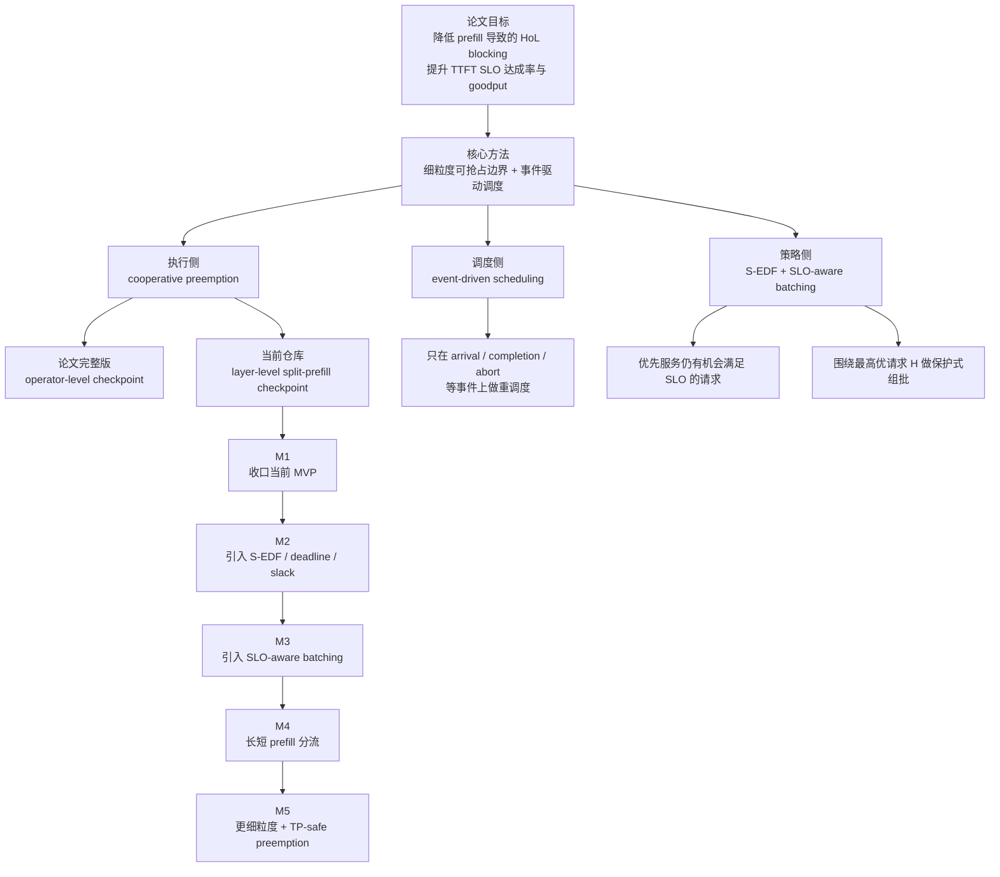

# FlowPrefill TODO

本文档用于跟踪 SGLang 中 FlowPrefill 的后续实现计划，并将当前仓库中的
layer-level MVP 与论文
[FlowPrefill: Decoupling Preemption from Prefill Scheduling Granularity to Mitigate Head-of-Line Blocking in LLM Serving](https://arxiv.org/abs/2602.16603)
中的完整设计对齐。

当前仓库状态：

- 已有 layer-level cooperative preemption 的实验版实现。
- 当前实现更接近 batch-level split-prefill resume，而不是论文中的完整
  request-level 调度模型。
- 当前仅实现 `priority_fcfs`，尚未实现 slack-aware 的 deadline 调度。
- 还未实现 SLO-aware batching、长短 prefill 分流、operator-level
  preemption 和 TP-safe coordinated preemption。

## 当前实现进展

截至本轮开发，FlowPrefill 已经从“纯 batch-level parked queue”推进到
“request-owned state + req-level parked queue 的过渡形态”：

- `Req` 已持有 `flowprefill_ctx`，用于保存 request-owned 的长期恢复态。
- `preempted_prefill_queue` 已从 `ScheduleBatch` 级切到 `Req` 级。
- 单请求 parked req 已支持一条真实的 request-owned resume 路径：
  在满足安全 guard 时，不再依赖 `resume_batch`，而是直接从
  `Req.flowprefill_ctx` 重建单请求 `ScheduleBatch`。
- 多请求 parked batch 目前仍通过 `resume_batch` 兼容恢复；
  这是一层显式过渡，不是最终设计。
- 单请求 request-owned resume 的 guard 和 fallback reason 已显式化，
  便于后续逐步放宽支持范围。

当前还没有做到的关键点：

- 多请求 preempted req 的真正 regroup 仍未实现。
- 单请求 request-owned resume 仍只对安全子集开放：
  非 grammar、非 multimodal、非 input_embeds、非
  encoder-decoder 等。
- 其中 `input_embeds`、grammar、multimodal 已转入未来兼容性规划，
  不再作为近期实现优先项。
- 单请求恢复真实性虽已在 `Qwen3-30B-A3B` 上完成一轮验证，但还缺少
  更系统的自动化测试与跨模型验证覆盖。
- 还没有接入 slack-aware scheduling，也没有引入 remaining-time predictor。

## 下一步具体任务

建议下一轮按下面顺序推进；当前决定先跳过“补自动化测试 / 第二模型验证”，
优先做可观测性和 guard 边界清理：

### P0：先补可观测性，收集后续决策所需信号

- 补充单请求恢复时的日志和指标：
  记录是否走 request-owned resume、是否 fallback、fallback reason。
- 增加队列与恢复深度观测：
  `preempted_prefill_queue` 长度、resume depth（`split_index`）、
  每请求 preemption 次数、preemption latency。
- 输出足够结构化的信息，能够复盘：
  arrival -> mark preempt pending -> preempted -> resumed -> finished/aborted。

### P1：清理单请求恢复的 guard 边界

- 近期只审计 `encoder-decoder` 是否真的是硬限制。
- `input_embeds`、grammar、multimodal 暂时不做，转入未来兼容性规划。
- 对短期内不准备支持的限制，在用户文档和日志里继续明确说明。

### P2：回补单请求 request-owned resume 的自动化验证

- 增加一个更贴近真实实现的测试，验证单请求恢复路径不会回到
  `prepare_for_extend()`，也不会重新分配 KV。
- `Qwen3-30B-A3B` 已完成一轮单请求恢复真实性验证：
  恢复后的 forward 能从 `split_index > 0` 继续。
- 后续补齐自动化验证：
  至少再覆盖一类 Llama 模型，并把“非零 `split_index` 恢复”收进集成测试。

### P3：开始做真正的多请求 request-level resume

- 去掉“多请求 parked batch 依赖 `resume_batch` 恢复”的兼容层。
- 先支持最保守版本：
  只允许相同 `split_index` 的 preempted req 单独恢复，不做 regroup。
- 然后再做下一步：
  支持相同 `split_index` 的多个 req regroup，继续禁止不同 `split_index`
  混批。

### P4：为后续 slack-aware scheduling 预留接口

- 在 `Req` 上补齐 arrival/deadline/slack/remaining-time 需要的字段。
- 把 `_flowprefill_priority_key()` 重构成 policy dispatcher，
  为 `deadline_fcfs` 和 `slack_edf` 做接口预留。
- 先加测试桩，不急着实现完整策略。

### Future：兼容性扩展规划

- 未来再评估单请求 request-owned resume 对 `input_embeds` 的支持，
  重点检查恢复后输入 embedding 与 KV / cache index 的一致性。
- 未来再评估 grammar-constrained request 的支持，
  重点检查 grammar runtime state 是否能跨 split-prefill resume 保持一致。
- 未来再评估 multimodal request 的支持，
  重点检查 multimodal preprocessing / embedding state 是否能稳定复用。

论文与设计笔记中最值得保留的原则：

- 解耦“抢占粒度”和“调度频率”。
- 执行侧检查必须足够轻，只做 flag 检查与安全停下。
- 完整调度只在真正有意义的事件上触发。
- 先把 resume 语义做正确、做便宜，再去做更细粒度抢占点。
- 评估不应只看吞吐，还要看 TTFT SLO 达成率与 goodput。

## 逻辑框架图

## 里程碑总览

### M1：收口当前 layer-level MVP

目标：把当前单机、单卡、layer-level 的 FlowPrefill 做到“语义正确、测试充分、
指标可观测、能稳定用于 benchmark”。

### M2：引入 deadline/slack-aware 调度

目标：从纯 `priority_fcfs` 升级到论文风格的 S-EDF，基于 deadline 和
predicted remaining prefill time 做调度。

### M3：引入 SLO-aware batching

目标：围绕最高优请求 `H` 组 batch，并保证“为了提高利用率而加入其他请求”
不会让 `H` 违约。

### M4：引入长短 prefill 分流

目标：把短请求的 batching 优化和长请求的 preemptibility 优化分开处理，
结合 LAPS 风格的长短分流思路。

### M5：探索更细粒度与分布式安全抢占

目标：评估是否要从 layer-level 继续下沉到 runtime-visible 的更细边界，
以及如何在 TP/EP/DP 下实现 coordinated pause/resume。

## M1：Layer-Level MVP 收口

### 1. 正确性

- 明确当前实现已经进入“request-owned state + req-level parked queue”的
  过渡阶段，并避免再把新的恢复逻辑继续绑定回 `ScheduleBatch`。
- 重新审视当前 batch-level resume 设计，判断是否需要对同一
  `split_index` 的 preempted 请求做 request-level regrouping。
- 把 “不同 `split_index` 的请求绝不能进入同一个 split-prefill batch”
  这个 no-mix 约束显式固化到实现和测试里。
- 审计 `split_forward_batch` 生命周期，确保在 abort、finish、重复 preempt
  后不残留隐藏 GPU 状态。
- 验证 split-prefill 请求在所有 abort 路径上都能正确释放 KV、tree-cache、
  request-pool 等资源。
- 重新检查 FlowPrefill 与 grammar、logprob、hidden-state return、
  embedding/embedding-only 等非默认路径的交互。
- 确认 resume 后不会重复做 embedding，也不会重复执行已完成层。
- 明确 `split_attn_backend_needs_reinit` 是否足以覆盖所有 resume 路径；
  若不够，需要补充 attention backend 的状态恢复/重建逻辑。

### 2. 调度行为

- 收紧当前 “arrival 就给 running batch 打 preempt_pending 标记” 的策略，
  引入防饥饿、minimum run time、cooldown 等机制。
- 基于 benchmark 数据补清 `flowprefill_max_preemptions` 的语义与默认策略。
- 明确 resumed split-prefill batch 是否只在 `arrival / finish / abort`
  三类事件上重排，还是需要少量额外触发来改善公平性。
- 明确 `PrefillAdder.preempt_to_schedule()` 在 FlowPrefill 开启时是保留兜底，
  还是显式 bypass。
- 把 scheduler 的事件模型写清楚，并和论文的 event-driven 控制面对齐：
  arrival、completion、abort，以及是否需要显式建模 preemption ACK。

### 3. 兼容性

- 为实现和未实现 `forward_split_prefill()` 的模型补 capability detection
  测试。
- 明确当前 model capability check 只在 scheduler 初始化阶段 best-effort
  检测是否足够，是否要在启动日志/API 层更显式暴露。
- 后续逐步扩展支持范围：overlap scheduling、speculative decoding、
  PD disaggregation、TP-safe coordinated preemption、PP、DP-attention。
- 明确未来是否要支持与 chunked prefill 共存，以及两者的优先级和互斥关系。
- 梳理 MoE 模型支持预期，确认当前 `forward_split_prefill()` 实现是否具备
  和 dense 模型类似的安全恢复边界。

### 4. 测试

- 在完整 Python 测试环境下跑通现有 scheduler 单测。
- 增加一类专门针对 request-owned resume 的测试：
  单请求 parked req 从 `Req.flowprefill_ctx` 重建 batch，并且不走
  `prepare_for_extend()` / 不重新分配 KV。
- 增加集成测试，覆盖：
  长 prefill 被短高优请求打断、从非零 `split_index` 恢复、多个 preempted
  batch 堆积、split-prefill 中 abort、多次 resume 后 finish。
- 增加不同 `split_index` 的 no-mix regression test。
- 增加 fallback 测试，验证以下情况不会误走单请求恢复：
  多请求 parked batch、缺失 `split_forward_batch`、grammar/logprob 等
  当前仍不支持的路径。
- 至少对 Llama 和 Qwen 增加 FlowPrefill 开/关的输出等价性测试。
- 增加资源生命周期测试，显式检查 finish、abort、重复 preempt-resume 之后
  KV/tree-lock/request-pool 是否正确清理。
- 增加 `flowprefill_max_preemptions` 在持续 urgent arrival 下的行为测试。

### 5. 可观测性

- 增加指标和日志：
  preempted prefill 请求数、resumed 请求数、`preempted_prefill_queue`
  当前长度、resume depth（`split_index`）、每请求 preemption 次数、
  preemption latency。
- 输出足够结构化的信息，能够复盘：
  arrival -> mark preempt pending -> preempted -> resumed -> finished/aborted。
- 如果长期维持 batch-level resume，需要重新审视命名，避免把当前能力表述成
  完整的 request-level FlowPrefill。

## M2：S-EDF 与 Deadline Awareness

论文的下一步关键能力不是更细粒度，而是 slack-aware scheduling。

### 1. 调度策略

- 在 `--flowprefill-priority-policy=deadline_fcfs` 或等效模式下，补齐
  `prefill_deadline_ts` 的完整处理。
- 为请求补齐并串通这些字段：
  arrival time、TTFT SLO、deadline、predicted remaining prefill time、slack。
- 实现第一版 S-EDF：
  优先处理 slack >= 0 的可行请求，再按 slack 更小者优先。
- 明确对已经 infeasible 的请求如何降权，避免它们拖垮系统 goodput，
  同时又不造成永久饥饿。
- 决定如何组合“用户优先级”和“slack”：
  严格优先级分层、加权组合，还是字典序排序。

### 2. 代价预测

- 增加 lightweight predictor，用于估计请求剩余 prefill 时间。
- 明确预测应基于哪些因素：
  prompt 长度、模型族、batch shape、当前 `split_index`、历史 batch latency。
- 决定是做 token-based、layer-based、batch-latency-model-based，还是 hybrid。
- 评估预测误差，并验证 S-EDF 在 noisy estimate 下的鲁棒性。

### 3. 验证

- 为 slack 计算和零 slack、过期请求等边界情况补测试。
- 在 overload 场景下，对比 `priority_fcfs`、plain EDF、S-EDF 的
  TTFT SLO 达成率和 goodput。

## M3：SLO-Aware Batching

论文中的 batching 不是“尽量塞满”，而是“围绕最高优请求 `H` 做受保护组批”。

### 1. 核心设计

- 替换或增强当前 prefill 组批逻辑：
  先选最高优请求 `H`，再在不让 `H` 超出剩余时间预算的前提下，贪心加入其他请求。
- 引入显式 token budget 或等效 batch budget 作为硬约束。
- 在构建 FlowPrefill batch 时继续保持当前 `split_index` 的 no-mix 约束。
- 决定 waiting 请求和 preempted 请求是否应被对称地纳入 batching，
  还是对 resumed 请求做额外保护。

### 2. 所需建模

- 建立 merged prefill batch latency estimator。
- 决定采用 per-model latency table、在线 EMA，还是更简单的启发式。
- 在 SGLang 中验证论文的关键观察：
  短请求从 batching 中明显受益，而长请求往往已经吃满 GPU，
  继续并批带来的吞吐收益有限，TTFT 反而更容易恶化。

### 3. 验证

- 增加 prompt length 与 batch size sweep 的 microbenchmark，
  用来拟合 latency/budget model。
- 增加端到端 benchmark，对比：
  baseline、仅 FlowPrefill、FlowPrefill + SLO-aware batching。

## M4：长短 Prefill 分流

设计笔记里已经提出，将 FlowPrefill 与 LAPS 风格的长短分流结合，会比单一
队列策略更合理。

### 1. 队列与路由

- 定义 short/long prefill 的路由启发式：
  基于 prompt 长度、predicted prefill time、slack 或组合特征。
- 评估短请求队列是否更适合做 shape regularization 与积极 batching，
  长请求队列是否更适合做 preemptible execution。
- 决定分流方式是 hard partition、soft preference，还是随负载动态调整。

### 2. 运行时集成

- 评估与 CUDA Graph eligibility、fused kernel、shape regularization 的关系。
- 决定长短分流是否仍放在同一个 scheduler 中，还是演进成不同执行 lane。

### 3. 验证

- 在长尾 prompt + burst urgent short prompt 的工作负载下做 benchmark。
- 与当前单队列 FlowPrefill 设计对比 TTFT、goodput、throughput loss。

## M5：更细粒度与分布式安全抢占

论文完整版使用 operator-level checkpoint，并在 tensor parallel 下做协调抢占。

### 1. 更细粒度检查点

- 审计 SGLang 当前运行时里是否存在可见且安全的边界，接近：
  qkv projection、attention、output projection、MLP up/gate、MLP down。
- 判断在大量 fused kernel 和不同模型实现下，哪些检查点是真正可落地的。
- 只有在 M1 的 resume 语义稳定且已验证收益后，再推进 finer-grained
  preemption prototype。

### 2. 分布式安全

- 设计 TP-safe coordinated pause/resume，确保所有 rank 在同一逻辑点停下，
  不会因为 collective 不对齐而死锁。
- 评估 EP 和 DP 是否需要不同的协调协议。
- 确定需要什么共享 progress marker / iteration counter 才能保证多并行
  worker 进度一致。

### 3. 中间状态与内存

- 明确哪些中间状态必须留在 GPU 上以支持 resumed execution，
  哪些状态可以丢弃并重建。
- 量化更细粒度抢占在中间状态保留上的 OOM 风险，并和 layer-level resume
  进行对比。

## Benchmark 计划

所有里程碑的推进都要由数据驱动，而不是只靠语义讨论。

### 1. 延迟与 SLO 指标

- TTFT p50、p90、p95、p99。
- urgent 请求与 background 请求分开统计的 TTFT。
- TTFT SLO 达成率。
- preemption latency。

### 2. 吞吐与效率指标

- req/s。
- token/s。
- 在 TTFT SLO 约束下的 goodput。
- GPU utilization。
- scheduler CPU overhead。

### 3. FlowPrefill 特有指标

- 每请求 preemption 次数的平均值与分布。
- resume depth 分布，也就是 resumed 时的 `split_index`。
- 请求在 `preempted_prefill_queue` 中停留的时间。
- resume 时保持原 batch shape 与发生 regroup 的比例。

### 4. 核心工作负载

- 一个长时间运行的 background prefill，加若干 burst urgent short 请求。
- 长短混合、接近真实生产分布的 prompt workload。
- overload 场景：系统中并非所有请求都有机会满足 TTFT SLO。
- 不同 `split_index` 的 preempted 请求同时堆积的场景。

## 文档与接口收口

- 保持 public docs 与实际支持范围一致，明确区分“当前实验版行为”和
  “论文完整版目标”。
- 增加调优建议：何时应该优先使用 FlowPrefill，何时应考虑 chunked prefill
  或 PD disaggregation。
- 在文档中明确说明当前 SGLang 的 layer-level split-prefill 与论文中
  operator-level FlowPrefill 的语义差异。
