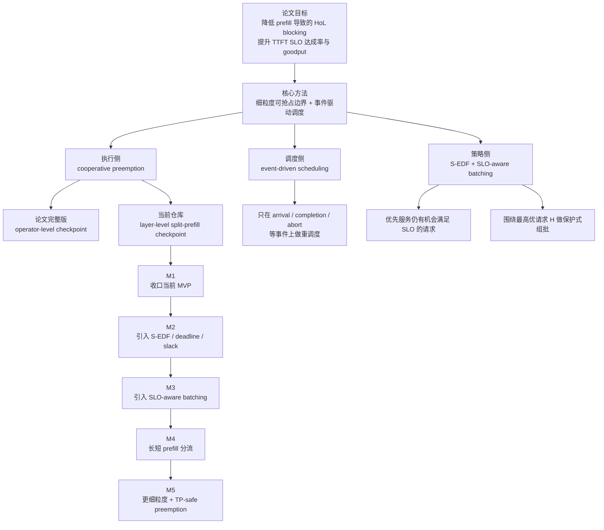

# FlowPrefill TODO

本文档用于跟踪 SGLang 中 FlowPrefill 的后续实现计划，并将当前仓库中的
layer-level MVP 与论文
[FlowPrefill: Decoupling Preemption from Prefill Scheduling Granularity to Mitigate Head-of-Line Blocking in LLM Serving](https://arxiv.org/abs/2602.16603)
中的完整设计对齐。

当前仓库状态：

- 已有 layer-level cooperative preemption 的实验版实现。
- 当前实现已从“batch-level split-prefill resume”进一步推进到
  “request-owned resume + 同 `split_index` regroup 已落地”的过渡形态。
- 当前已把 `_flowprefill_priority_key()` 重构为 policy dispatcher，
  并已把 `deadline_fcfs` / `slack_edf` 接入最小的 heuristic predictor；
  第一版 feasible-first 的 S-EDF 已落地，但完整 slack-aware deadline
  调度仍未实现。
- 当前 `slack_edf` 已按论文定义计算
  `slack = deadline - now - TTFT_hat`，并在排序上先保护
  `slack >= 0` 的 feasible 请求，再整体降权 `slack < 0` 的请求。
- 当前仍只是第一版策略收口：
  `TTFT_SLO` 主要来自 server 级默认值，`TTFT_hat` 仍由 lightweight
  heuristic predictor 提供，还没有 workload-aware 校准。
- 当前 heuristic predictor 已从“单一全局平均层耗时”升级为三级回退：
  优先使用 request-local split 观测，其次使用按 prompt length 分桶的
  bucket 观测，最后才退回 scheduler-global 观测；但它仍属于轻量启发式，
  还没有引入更细的 batch-shape / runtime 校准。
- 还未实现 SLO-aware batching、长短 prefill 分流、operator-level
  preemption 和 TP-safe coordinated preemption。

## 当前实现进展

截至本轮开发，FlowPrefill 已经从“纯 batch-level parked queue”推进到
“request-owned state + req-level parked queue 的过渡形态”：

- `Req` 已持有 `flowprefill_ctx`，用于保存 request-owned 的长期恢复态。
- `preempted_prefill_queue` 已从 `ScheduleBatch` 级切到 `Req` 级。
- 单请求 parked req 已支持一条真实的 request-owned resume 路径：
  在满足安全 guard 时，不再依赖 `resume_batch`，而是直接从
  `Req.flowprefill_ctx` 重建单请求 `ScheduleBatch`。
- 单请求 request-owned resume 已支持 `return_logprob`，
  不再因 logprob 路径退回 parked-batch resume。
- 多请求 parked batch 已支持最小 request-level resume：
  抢占时会尽量为每个 req 切出 request-owned 的单 req `ForwardBatch`
  快照，并已支持同 `split_index` 的 regroup 恢复，不再强依赖
  `resume_batch`。
- 对于无法安全切出单 req 快照的场景，当前仍保留 `resume_batch`
  fallback 作为兼容兜底；这是一层显式过渡，不是最终设计。
- 单请求 request-owned resume 的 guard 和 fallback reason 已显式化，
  便于后续逐步放宽支持范围。
- 已补一轮初始可观测性：
  有结构化日志区分 single-request resume / parked-batch fallback，
  并已有 parked queue、resume depth、fallback reason 等指标。
- 已补最小 regroup 能力：
  对同 `split_index`、且满足 request-owned resume guard 的 parked req，
  scheduler 可直接重组为 split-prefill batch 恢复，并已把 no-mix 约束
  固化到实现与单测。
- 开发期一次性验证日志已完成清理，当前仅保留长期有价值的
  observability / fallback 日志。
- `Req` 上已补齐 `arrival/deadline/slack/predicted remaining time`
  的接口字段；CLI 已接受 `priority_fcfs` / `deadline_fcfs` /
  `slack_edf`；请求侧 deadline/slack 字段赋值入口也已接通。
- 已接入一版 lightweight heuristic predictor：
  对未显式提供 `prefill_predicted_remaining_time` 的请求，scheduler
  会根据 split-prefill 的观测层耗时估计 remaining prefill time，并用于
  `slack_edf` 的缺省 slack 计算。
- 已补 server 级默认 SLO 参数：
  当请求未显式提供 `prefill_ttft_slo_ms` / `prefill_deadline_ts` 时，
  可由 `--flowprefill-default-ttft-slo-ms` 统一推导 deadline。

当前还没有做到的关键点：

- 单请求 request-owned resume 仍只对安全子集开放：
  非 grammar、非 multimodal、非 input_embeds、非
  encoder-decoder 等。
- 其中 `input_embeds`、grammar、multimodal 已转入未来兼容性规划，
  不再作为近期实现优先项。
- 单请求恢复真实性虽已在 `Qwen3-30B-A3B` 上完成一轮验证，但还缺少
  更系统的自动化测试覆盖。
- 在 `Qwen3-30B-A3B` 的当前实现上，单请求 FlowPrefill 抢占/恢复路径
  不能安全依赖 `--max-running-requests 1`：
  抢占后若 urgent 请求仍需新分配 req slot，scheduler 会在
  `alloc_req_slots()` 阶段失败；当前验证和测试应至少使用
  `--max-running-requests 2`。
- 当前 remaining-time predictor 仍是最小 heuristic 版本，
  deadline/slack 尚未经过 benchmark 校准，也还没有更强的 workload-aware
  predictor。
- 当前 predictor 虽已补 prompt-length bucket 化，但仍未引入更强的
  TTFT normalization、EMA、batch-shape-aware latency model，因此
  `slack_edf` 的最终效果仍需继续通过 benchmark 校准。
- 当前 `slack_edf` 已切到 feasible-first 语义：
  waiting queue、preempt 判断、以及 preempted queue 恢复都复用同一套
  request priority key，不再出现“更负 slack 反而更优先”的行为。
- 当前已尝试在 `slack_edf` 下引入第一版 waiting-side candidate batching：
  先从 waiting queue 选 seed，再吸收同 prompt bucket、且不会让 seed
  立即违反 SLO 的请求，形成 waiting candidate batch，并把这个 candidate
  的 key 拿去和 preempted candidate 比较。
- 当前 waiting-side candidate batching 已进一步升级：
  在保留“seed 不违约”约束的基础上，新增 queue externality / `harm(candidate)`
  惩罚项，并在 seed 选择上优先保护 feasible 的 short-bucket 请求。
- 当前 `harm(candidate)` 的核心语义是：
  统计“如果现在调度这个 waiting candidate，会让多少当前仍 feasible 的
  waiting 请求在额外等待这一个 candidate 的服务时间后转成 infeasible”。
- 在本轮 benchmark 上，这一版 `slack_edf` 已明显优于当前 `priority_fcfs`
  基线：在 `bg_rate=2/4/6/8`、统一 `TTFT_SLO=300ms` 的测试矩阵里，
  urgent goodput 已达到 `12/12`，而 background 在高负载下退到 `6/8`，
  说明策略已开始显式为 urgent 让路，而不再系统性保护 background。
- 这一轮开发中还修复了一个 waiting candidate 相关的回归：
  当 seed 不在队首时，candidate 构造可能把同一 `rid` 重复加入 batch，
  进而触发 `token_to_kv_pool_allocator memory leak detected`。
  当前已通过 `candidate_rids` 去重和回归单测修复该问题。
- 但当前 infeasible 请求的降权仍是最小版本：
  先整体落到 feasible 请求之后，再在 infeasible 集合内按 deadline/FCFS
  收口；是否需要更细的 goodput-aware 惩罚或 anti-starvation 机制，仍待 benchmark。
- 已确认 split-prefill runtime 观测链路现已生效，`predicted remaining`
  与 `effective slack` 都能在调试日志中看到非空值；之前 runtime 全为 0
  的问题来自只对 `EXTEND` 记录 prefill runtime，现已修复为对
  `SPLIT_PREFILL` 也记录。
- benchmark 已确认，“裸 `slack_edf` + 统一默认 TTFT SLO”确实不是可用终态；
  但在加入 prompt-bucket predictor、`k=8` request-local 冷启动保护、
  waiting candidate batching、short-seed 偏置、以及 `harm(candidate)`
  之后，`slack_edf` 已在当前主 workload 上表现出明确收益。
- 结合最新的本地 `QwenTrace` replay，尤其是
  `benchmark/flowprefill/bench_flowprefill_trace_replay.py` 配合
  `--override-max-new-tokens 1` 的 decode-controlled TTFT 实验，
  当前 `slack_edf` 又暴露出一个新的局限：
  紧 SLO 的短请求一旦被 predictor 判入 infeasible 集，当前
  feasible-first 排序很难把它们重新“捞回来”。
- 当前这类问题不再能简单归因于 decode 长尾，因为在 `max_new_tokens=1`
  的 replay 中，这一现象仍然存在；因此它更像是当前 policy + predictor
  组合的真实限制。
- 当前 regroup 仍是最小版本：
  只对同 `split_index`、且满足 request-owned resume guard 的 parked req 生效，
  更复杂的 regroup / fallback 收缩仍待继续收口。

## 下一步具体任务

建议下一轮按下面顺序推进；当前 regroup、日志 cleanup、deadline/slack
请求通路、以及 heuristic predictor 都已落地，下一步优先做 benchmark
和策略校准：

### Done：实现期日志验收与 cleanup 已完成

- 已用开发期结构化日志完成：
  非零 `split_index` 恢复、request-owned resume 不回到
  `prepare_for_extend()`、以及 regroup 恢复链路验收。
- 一次性验证日志已删除，仅保留长期 observability / fallback 日志。
- 后续若进入更严格回归阶段，再决定哪些语义约束需要沉淀为稳定测试。

### P1：清理近期需要的 guard 边界

- `encoder-decoder` 近期也不做，转入未来兼容性规划。
- `input_embeds`、grammar、multimodal 暂时不做，转入未来兼容性规划。
- 对短期内不准备支持的限制，在用户文档和日志里继续明确说明。

### Done：多请求 request-level resume 的最小版本已落地

- 已支持最保守版本：
  抢占时尽量把多请求 parked batch 切成 request-owned 的单 req 恢复态，
  后续优先按 request-owned 路径恢复。
- 当前验收结果表明，在已覆盖 workload 下，多请求恢复已不再以
  `resume batch has multiple requests` fallback 为主。
- 仍保留 `resume_batch` fallback 兜底，用于无法安全切片的场景；
  这层兼容在进入 regroup 之后再评估是否完全移除。

### Done：支持同 `split_index` 的 regroup

- 已支持同 `split_index`、且满足 request-owned resume guard 的 parked req
  重新组为 split-prefill batch 恢复。
- 已继续禁止不同 `split_index` 混批，并把 no-mix 约束固化到实现与单测。
- 下一步不再是“是否做 regroup”，而是继续评估是否收缩
  `resume_batch` fallback 兼容层。

### Done：把 deadline/slack 输入来源接起来

- 已在 `Req` 上补齐 arrival/deadline/slack/remaining-time 需要的字段。
- 已把 `_flowprefill_priority_key()` 重构成 policy dispatcher，
  并为 `deadline_fcfs` 和 `slack_edf` 加好接口桩。
- 已把这些字段接入 `GenerateReqInput -> TokenizedGenerateReqInput -> Req`
  的请求路径，并支持从 `prefill_ttft_slo_ms` 推导 deadline，
  以及在已有 deadline / remaining-time 时做最小 slack 推导。
- 已支持 `--flowprefill-default-ttft-slo-ms`，作为请求未显式提供
  `prefill_ttft_slo_ms` / `prefill_deadline_ts` 时的 server 级默认值。
- 当前仍不应把 `deadline_fcfs` / `slack_edf` 视为完整可用策略；
  它们已经具备请求元数据通路，但还缺少 benchmark 驱动的调参与策略收口。

### Done：引入 lightweight remaining-time predictor

- 已为 `prefill_predicted_remaining_time` 提供最小可用来源：
  对未显式传入 remaining time 的请求，优先使用 request-local 的
  split-prefill 观测均值；没有 request-local 观测时，再使用按 prompt
  length 分桶的 bucket 观测；bucket 里也没有数据时，才退到 scheduler
  级的全局观测均值。
- 当前分桶边界是：
  1. `<= 512`
  2. `513 - 2048`
  3. `> 2048`
- 当前 heuristic 仍基于
  `remaining layers * observed average layer latency`，但至少已经把
  `128 token urgent` 和 `8k background` 这类请求从同一个全局 latency
  统计里拆开。
- 显式传入的 `prefill_predicted_remaining_time` 与 `prefill_slack`
  仍然优先于 heuristic。
- 已通过开发期调试日志验证：
  修复 split-prefill runtime 采集后，新请求可先从 bucket/global 均值拿到
  初始 `predicted_remaining_time`，已运行请求则会逐步切换到 request-local
  观测均值。

### P6：策略收口与 benchmark 校准

- 在真实 workload 和 benchmark harness 上比较：
  `priority_fcfs`、`deadline_fcfs`、`slack_edf`。
- 重点观察 TTFT、goodput、deadline miss rate，以及 preempt/resume 次数。
- 当前阶段结论已经更新：
  `slack_edf` 的关键不再只是“是否采用 feasible-first”，而是要把
  predictor、waiting candidate batching、以及 queue externality
  一起收口成同一套策略。
- 当前已完成并验证有效的收口项：
  1. prompt-length bucket predictor
  2. `k=8` request-local predictor 冷启动保护
  3. waiting candidate batching
  4. feasible short-bucket seed 优先
  5. `harm(candidate)` 惩罚
- 当前主 workload 的阶段性 benchmark 结果：
  1. `priority_fcfs` 在 `bg_rate=2/4/6/8` 下的 urgent goodput 为
     `8/12`, `3/12`, `4/12`, `4/12`
  2. `slack_edf` 在同一矩阵下的 urgent goodput 为
     `12/12`, `12/12`, `12/12`, `12/12`
  3. `slack_edf` 的 tradeoff 是在 `bg_rate=6/8` 时 background 从 `8/8`
     降到 `6/8`
- 因此，P6 的下一步不再是“是否要引入 queue externality”，而是：
  1. 在更多 SLO 与负载区间验证当前版本是否稳定
  2. 继续与 `deadline_fcfs` 做 apples-to-apples 对比
  3. 评估是否还需要更强的 EMA / batch-shape-aware predictor
  4. 评估是否需要 anti-starvation 保护，避免 background 在更高压场景下被长期饿死

### P7：补 short-request rescue / anti-starvation 机制

- 当前 feasible-first `slack_edf` 对“刚刚掉入 infeasible 的短请求”保护不足。
- 本地 `QwenTrace` replay 表明：
  aggregate goodput 可以改善，但 `text` 这类 tight-SLO 短请求仍可能系统性恶化。
- 下一步需要在现有 slack key 之外，增加一层 bounded rescue 逻辑，用于：
  1. 保护 tight-SLO 的 short-bucket 请求
  2. 避免它们一旦被 predictor 判成负 slack 就长期失去竞争力
  3. 让 policy 不只是挑选 still-feasible 请求，而能在受控范围内抢救
     recently-infeasible 的交互请求
- 可以比较的实现方向：
  1. short-bucket rescue window
  2. age-aware infeasible ordering
  3. bounded rescue bonus
  4. class-aware minimum service guarantees

### P8：把 decode-controlled replay 纳入 FlowPrefill benchmark 常规流程

- 当前仓库已经有：
  1. `benchmark/flowprefill/build_qwentrace_workload.py`
  2. `benchmark/flowprefill/bench_flowprefill_trace_replay.py`
  3. `--override-max-new-tokens 1` 用于隔离 TTFT/prefill 效果
- 后续 benchmark 需要制度化两类结果：
  1. 原始 output length replay
  2. `max_new_tokens=1` replay
- 没有 decode-controlled 对照时，不应直接把 replay 结果解释为
  “FlowPrefill policy 本身更好/更差”。

### P8.1：把 request-rate 语义固定为连续时间窗口 replay

- 当前 benchmark 的另一个经验结论是：
  request-rate 语义必须尽量贴近原始 trace，而不能靠随机抽样后再人为重建时间轴。
- 之前的 `shuffle + truncate + preserve/compact` 思路会引入额外偏差：
  1. 打乱后失去原始 trace 的局部到达模式
  2. 抽样后的 delay 重建不再对应真实生产窗口
  3. 对 FlowPrefill 这类对 arrival pattern 敏感的调度策略，结论容易失真
- 当前 replay 脚本已经切换到连续时间窗口语义：
  1. `--window-start-seconds`
  2. `--time-window-seconds`
  3. `--max-requests`
  4. `--print-window-summary`
- 后续 benchmark 约定应明确：
  1. 优先使用连续时间窗口
  2. 固定窗口后再比较不同 policy
  3. 不再把随机打乱请求集作为默认 benchmark 入口
- 后续还可以继续补：
  1. 自动推荐“中等负载”窗口
  2. 按窗口输出平均 RPS / 按类请求数
  3. 按窗口批量 sweep，而不是只 sweep 请求数

### P9：继续校准 predictor，重点关注“短请求误判为 infeasible”的场景

- 当前 bucketized heuristic predictor 已经比全局均值更好，但仍不够。
- 需要新增面向短请求的误判诊断：
  1. 统计 short-bucket 请求从 arrival 到首次负 slack 的比例
  2. 统计 false-negative feasibility 的频率
  3. 区分 cold-start、resumed、regrouped 三类请求
- 评估方向：
  1. EMA / smoothing
  2. batch-shape-aware predictor
  3. resumed-request-specific normalization
  4. predictor error versus class-level goodput

### Future：兼容性扩展规划

- 未来再评估单请求 request-owned resume 对 `encoder-decoder` 的支持，
  重点检查 encoder cache、decoder KV、以及 split-prefill resume 之间的状态一致性。
- 未来再评估单请求 request-owned resume 对 `input_embeds` 的支持，
  重点检查恢复后输入 embedding 与 KV / cache index 的一致性。
- 未来再评估 grammar-constrained request 的支持，
  重点检查 grammar runtime state 是否能跨 split-prefill resume 保持一致。
- 未来再评估 multimodal request 的支持，
  重点检查 multimodal preprocessing / embedding state 是否能稳定复用。

论文与设计笔记中最值得保留的原则：

- 解耦“抢占粒度”和“调度频率”。
- 执行侧检查必须足够轻，只做 flag 检查与安全停下。
- 完整调度只在真正有意义的事件上触发。
- 先把 resume 语义做正确、做便宜，再去做更细粒度抢占点。
- 评估不应只看吞吐，还要看 TTFT SLO 达成率与 goodput。
- 当前实现阶段优先接受“临时日志验证 + 验收后删除”的方式来验证恢复语义，
  避免过早在快速迭代期绑定脆弱测试。

## 逻辑框架图



## 里程碑总览

### M1：收口当前 layer-level MVP

目标：把当前单机、单卡、layer-level 的 FlowPrefill 做到“语义正确、测试充分、
指标可观测、能稳定用于 benchmark”。

### M2：引入 deadline/slack-aware 调度

目标：从纯 `priority_fcfs` 升级到论文风格的 S-EDF，基于 deadline 和
predicted remaining prefill time 做调度。

### M3：引入 SLO-aware batching

目标：围绕最高优请求 `H` 组 batch，并保证“为了提高利用率而加入其他请求”
不会让 `H` 违约。

补充说明：

- 当前仓库已经有一版最小 waiting-side candidate batching，但实验结果表明，
  只保护 `H` 自己仍然不够。
- 论文式 batching 不能只把 `H` 当作唯一目标；在 mixed workload 里，
  还需要把该 batch 对整个 waiting queue 的阻塞外部性算进去。
- 因此本阶段的下一版目标不再只是“protect `H`”，而是：
  `protect H while minimizing collateral SLO damage to other feasible waiting requests`。

### M4：引入长短 prefill 分流

目标：把短请求的 batching 优化和长请求的 preemptibility 优化分开处理，
结合 LAPS 风格的长短分流思路。

### M5：探索更细粒度与分布式安全抢占

目标：评估是否要从 layer-level 继续下沉到 runtime-visible 的更细边界，
以及如何在 TP/EP/DP 下实现 coordinated pause/resume。

## M1：Layer-Level MVP 收口

### 1. 正确性

- 明确当前实现已经进入“request-owned state + req-level parked queue”的
  过渡阶段，并避免再把新的恢复逻辑继续绑定回 `ScheduleBatch`。
- 重新审视当前 batch-level resume 设计，判断是否需要对同一
  `split_index` 的 preempted 请求做 request-level regrouping。
- 把 “不同 `split_index` 的请求绝不能进入同一个 split-prefill batch”
  这个 no-mix 约束显式固化到实现和测试里。
- 审计 `split_forward_batch` 生命周期，确保在 abort、finish、重复 preempt
  后不残留隐藏 GPU 状态。
- 验证 split-prefill 请求在所有 abort 路径上都能正确释放 KV、tree-cache、
  request-pool 等资源。
- 重新检查 FlowPrefill 与 grammar、logprob、hidden-state return、
  embedding/embedding-only 等非默认路径的交互。
- 确认 resume 后不会重复做 embedding，也不会重复执行已完成层。
- 明确 `split_attn_backend_needs_reinit` 是否足以覆盖所有 resume 路径；
  若不够，需要补充 attention backend 的状态恢复/重建逻辑。

### 2. 调度行为

- 收紧当前 “arrival 就给 running batch 打 preempt_pending 标记” 的策略，
  引入防饥饿、minimum run time、cooldown 等机制。
- 基于 benchmark 数据补清 `flowprefill_max_preemptions` 的语义与默认策略。
- 明确 resumed split-prefill batch 是否只在 `arrival / finish / abort`
  三类事件上重排，还是需要少量额外触发来改善公平性。
- 明确 `PrefillAdder.preempt_to_schedule()` 在 FlowPrefill 开启时是保留兜底，
  还是显式 bypass。
- 把 scheduler 的事件模型写清楚，并和论文的 event-driven 控制面对齐：
  arrival、completion、abort，以及是否需要显式建模 preemption ACK。

### 3. 兼容性

- 为实现和未实现 `forward_split_prefill()` 的模型补 capability detection
  测试。
- 明确当前 model capability check 只在 scheduler 初始化阶段 best-effort
  检测是否足够，是否要在启动日志/API 层更显式暴露。
- 后续逐步扩展支持范围：overlap scheduling、speculative decoding、
  PD disaggregation、TP-safe coordinated preemption、PP、DP-attention。
- 明确未来是否要支持与 chunked prefill 共存，以及两者的优先级和互斥关系。
- 梳理 MoE 模型支持预期，确认当前 `forward_split_prefill()` 实现是否具备
  和 dense 模型类似的安全恢复边界。

### 4. 测试

- 在完整 Python 测试环境下跑通现有 scheduler 单测。
- 当前已补单测覆盖：
  single-request request-owned resume、parked-batch fallback resume、
  fallback reason、`return_logprob` 单请求恢复，以及 predictor 的
  request-local / bucket / global 回退顺序。
- 本机若遇到 `flashinfer-jit-cache version ... does not match flashinfer version`
  的环境问题，可在运行相关单测前设置下面这些环境变量：

```bash
FLASHINFER_DISABLE_VERSION_CHECK=1 \
HOME=/tmp \
XDG_CACHE_HOME=/tmp \
PYTHONPATH=/share/wwmq/mywork/sglang/python \
python -m pytest test/registered/unit/managers/test_flowprefill_scheduler.py -q
```
- 增加一类专门针对 request-owned resume 的测试：
  单请求 parked req 从 `Req.flowprefill_ctx` 重建 batch，并且不走
  `prepare_for_extend()` / 不重新分配 KV。
- 增加集成测试，覆盖：
  长 prefill 被短高优请求打断、从非零 `split_index` 恢复、多个 preempted
  batch 堆积、split-prefill 中 abort、多次 resume 后 finish。
- 增加不同 `split_index` 的 no-mix regression test。
- 增加 fallback 测试，验证以下情况不会误走单请求恢复：
  多请求 parked batch、缺失 `split_forward_batch`、grammar/logprob 等
  当前仍不支持的路径。
- 至少对 Llama 和 Qwen 增加 FlowPrefill 开/关的输出等价性测试。
- 增加资源生命周期测试，显式检查 finish、abort、重复 preempt-resume 之后
  KV/tree-lock/request-pool 是否正确清理。
- 增加 `flowprefill_max_preemptions` 在持续 urgent arrival 下的行为测试。

### 5. 可观测性

- 当前已补首轮指标和日志：
  preempted / resumed / fallback 计数、`preempted_prefill_queue`
  当前长度、resume depth（`split_index`）、parked duration，
  以及区分 single-request resume / parked-batch fallback 的结构化日志。
- 下一步补足仍欠缺的项：
  每请求 preemption 次数、preemption latency 的最终口径，以及更完整的
  事件链回放。
- 如果长期维持 batch-level resume，需要重新审视命名，避免把当前能力表述成
  完整的 request-level FlowPrefill。

## M2：S-EDF 与 Deadline Awareness

论文的下一步关键能力不是更细粒度，而是 slack-aware scheduling。

### 1. 调度策略

- 在 `--flowprefill-priority-policy=deadline_fcfs` 或等效模式下，补齐
  `prefill_deadline_ts` 的完整处理。
- 为请求补齐并串通这些字段：
  arrival time、TTFT SLO、deadline、predicted remaining prefill time、slack。
- 实现第一版 S-EDF：
  优先处理 slack >= 0 的可行请求，再按 slack 更小者优先。
- 明确对已经 infeasible 的请求如何降权，避免它们拖垮系统 goodput，
  同时又不造成永久饥饿。
- 决定如何组合“用户优先级”和“slack”：
  严格优先级分层、加权组合，还是字典序排序。

### 2. 代价预测

- 增加 lightweight predictor，用于估计请求剩余 prefill 时间。
- 明确预测应基于哪些因素：
  prompt 长度、模型族、batch shape、当前 `split_index`、历史 batch latency。
- 决定是做 token-based、layer-based、batch-latency-model-based，还是 hybrid。
- 评估预测误差，并验证 S-EDF 在 noisy estimate 下的鲁棒性。

### 3. 验证

- 为 slack 计算和零 slack、过期请求等边界情况补测试。
- 在 overload 场景下，对比 `priority_fcfs`、plain EDF、S-EDF 的
  TTFT SLO 达成率和 goodput。

## M3：SLO-Aware Batching

论文中的 batching 不是“尽量塞满”，而是“围绕最高优请求 `H` 做受保护组批”。

### 1. 核心设计

- 替换或增强当前 prefill 组批逻辑：
  先选最高优请求 `H`，再在不让 `H` 超出剩余时间预算的前提下，贪心加入其他请求。
- 引入显式 token budget 或等效 batch budget 作为硬约束。
- 在构建 FlowPrefill batch 时继续保持当前 `split_index` 的 no-mix 约束。
- 决定 waiting 请求和 preempted 请求是否应被对称地纳入 batching，
  还是对 resumed 请求做额外保护。

### 2. 所需建模

- 建立 merged prefill batch latency estimator。
- 决定采用 per-model latency table、在线 EMA，还是更简单的启发式。
- 在 SGLang 中验证论文的关键观察：
  短请求从 batching 中明显受益，而长请求往往已经吃满 GPU，
  继续并批带来的吞吐收益有限，TTFT 反而更容易恶化。

### 3. 验证

- 增加 prompt length 与 batch size sweep 的 microbenchmark，
  用来拟合 latency/budget model。
- 增加端到端 benchmark，对比：
  baseline、仅 FlowPrefill、FlowPrefill + SLO-aware batching。

## M4：长短 Prefill 分流

设计笔记里已经提出，将 FlowPrefill 与 LAPS 风格的长短分流结合，会比单一
队列策略更合理。

### 1. 队列与路由

- 定义 short/long prefill 的路由启发式：
  基于 prompt 长度、predicted prefill time、slack 或组合特征。
- 评估短请求队列是否更适合做 shape regularization 与积极 batching，
  长请求队列是否更适合做 preemptible execution。
- 决定分流方式是 hard partition、soft preference，还是随负载动态调整。

### 2. 运行时集成

- 评估与 CUDA Graph eligibility、fused kernel、shape regularization 的关系。
- 决定长短分流是否仍放在同一个 scheduler 中，还是演进成不同执行 lane。

### 3. 验证

- 在长尾 prompt + burst urgent short prompt 的工作负载下做 benchmark。
- 与当前单队列 FlowPrefill 设计对比 TTFT、goodput、throughput loss。

## M5：更细粒度与分布式安全抢占

论文完整版使用 operator-level checkpoint，并在 tensor parallel 下做协调抢占。

### 1. 更细粒度检查点

- 审计 SGLang 当前运行时里是否存在可见且安全的边界，接近：
  qkv projection、attention、output projection、MLP up/gate、MLP down。
- 判断在大量 fused kernel 和不同模型实现下，哪些检查点是真正可落地的。
- 只有在 M1 的 resume 语义稳定且已验证收益后，再推进 finer-grained
  preemption prototype。

### 2. 分布式安全

- 设计 TP-safe coordinated pause/resume，确保所有 rank 在同一逻辑点停下，
  不会因为 collective 不对齐而死锁。
- 评估 EP 和 DP 是否需要不同的协调协议。
- 确定需要什么共享 progress marker / iteration counter 才能保证多并行
  worker 进度一致。

### 3. 中间状态与内存

- 明确哪些中间状态必须留在 GPU 上以支持 resumed execution，
  哪些状态可以丢弃并重建。
- 量化更细粒度抢占在中间状态保留上的 OOM 风险，并和 layer-level resume
  进行对比。

## Benchmark 计划

所有里程碑的推进都要由数据驱动，而不是只靠语义讨论。

### 1. 延迟与 SLO 指标

- TTFT p50、p90、p95、p99。
- urgent 请求与 background 请求分开统计的 TTFT。
- TTFT SLO 达成率。
- preemption latency。

### 2. 吞吐与效率指标

- req/s。
- token/s。
- 在 TTFT SLO 约束下的 goodput。
- GPU utilization。
- scheduler CPU overhead。

### 3. FlowPrefill 特有指标

- 每请求 preemption 次数的平均值与分布。
- resume depth 分布，也就是 resumed 时的 `split_index`。
- 请求在 `preempted_prefill_queue` 中停留的时间。
- resume 时保持原 batch shape 与发生 regroup 的比例。

### 4. 核心工作负载

- 一个长时间运行的 background prefill，加若干 burst urgent short 请求。
- 长短混合、接近真实生产分布的 prompt workload。
- overload 场景：系统中并非所有请求都有机会满足 TTFT SLO。
- 不同 `split_index` 的 preempted 请求同时堆积的场景。

## 文档与接口收口

- 保持 public docs 与实际支持范围一致，明确区分“当前实验版行为”和
  “论文完整版目标”。
- 增加调优建议：何时应该优先使用 FlowPrefill，何时应考虑 chunked prefill
  或 PD disaggregation。
- 在文档中明确说明当前 SGLang 的 layer-level split-prefill 与论文中
  operator-level FlowPrefill 的语义差异。
